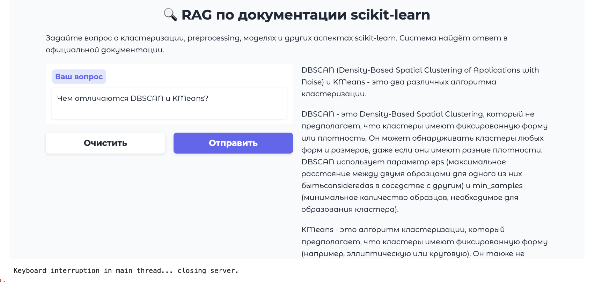

# 🚀 RAG по документации scikit-learn

Этот проект реализует **RAG-систему (Retrieval-Augmented Generation)** на основе официальной документации [scikit-learn](https://scikit-learn.org), позволяя задавать вопросы и получать точные ответы с указанием источников.

---

## 🔍 Что делает система?

- 📥 Автоматически скачивает и распаковывает **актуальную документацию** scikit-learn.
- 🧹 Очищает HTML, извлекает контекст (хлебные крошки, заголовки) и разбивает на чанки.
- 🧠 Векторизует текст с помощью `bge-m3` (через Ollama).
- 🔍 Использует **FAISS** для быстрого поиска.
- 🤖 Генерирует ответы с помощью `llama3`.
- 🖥️ Предоставляет **Gradio-интерфейс** для удобного взаимодействия.

---

## 🧪 Примеры вопросов

1. Какой параметр в KMeans отвечает за количество кластеров?
2. Чем отличаются KMeans и MiniBatchKMeans?
3. Почему scikit-learn не поддерживает обучение с подкреплением?

---

## 🚀 Как запустить?

### 1. Установите зависимости
```bash
pip install -r requirements.txt
```

### 2. Установите и запустите Ollama
Если у вас ещё не установлен Ollama, скачайте его с официального сайта:  
👉 [https://ollama.com/download](https://ollama.com/download)

### 3. Загрузите необходимые модели
Выполните в терминале:
```bash
ollama pull bge-m3
ollama pull llama3
```

- `bge-m3` нужна для **векторизации (эмбеддингов)**
- `llama3` нужна для **генерации ответов**

### 4. Запустите сервер Ollama (для генерации)
В **отдельном терминале** запустите:
```bash
ollama run llama3
```
> ⚠️ Оставьте этот терминал открытым — он нужен для генерации ответов.

### 5. Запустите Jupyter
```bash
jupyter notebook
```

### 6. Откройте ноутбук
`RAG_scikit-learn.ipynb`

> 💡 Первый запуск может занять 5–10 минут: система скачает документацию, построит чанки и FAISS-индекс.


---

## 🖥️ Интерфейс

После запуска Gradio, откроется веб-интерфейс, где можно задавать вопросы и видеть ответы с **ссылками на официальную документацию**.



---

## 📂 Структура проекта
```
scikit-learn-rag/
├── README.md
├── RAG_scikit-learn.ipynb
├── output/                  # (опционально) сохранённые чанки и FAISS
├── requirements.txt
├── .gitignore
└── LICENSE
```

## 📄 Лицензия
Проект распространяется под лицензией MIT.